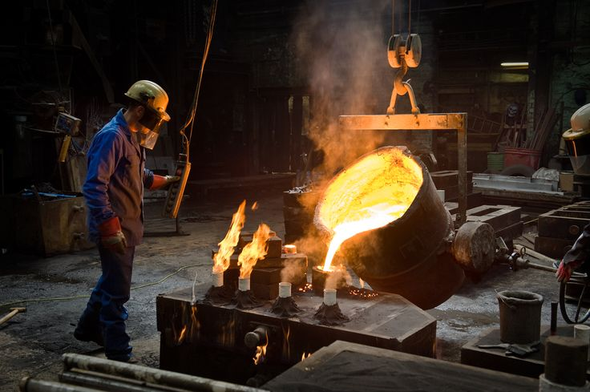

### Hi there 👋, I'm Viraj Jagdale

<!--    -->

- 👨‍🔧 Experienced working in Thermo-Calc, Quantum ESPRESSO, Machine Learning and Data Analysis for applications in Material Science and Engineering
- 🤔 Exploring new and exciting ideas, reach out to me : virajbalasahebjagdale@gmail.com
- 👨‍💻 Currently a Final year B.Tech student pursuing Material Science Engineering from IIT Jodhpur.

<!-- 
 - 🖥️ Coding Environment: Dark 🕶️ + Music 🎧 + Tea 🍵 
 - 📫 How to reach me **ak9836919@gmail.com**
 - 🌱 I love watching tech videos and exploring new stuffs. 
-->

Checkout my :file_folder: [Resume](https://drive.google.com/file/d/1izftUIdZYiFrDVm2v9eEfS3j-a5ItIsB/view?usp=sharing) 

## 🚀 Languages and Tools:

<!--

<b>Note:</b> Top languages is only a metric of the languages my public code consists of and doesn't reflect experience or skill level.

-->

## Connect with me:

<!--
**viraj17122002/viraj17122002** is a ✨ _special_ ✨ repository because its `README.md` (this file) appears on your GitHub profile.

Here are some ideas to get you started:

- 🔭 I’m currently working on ...
- 🌱 I’m currently learning ...
- 👯 I’m looking to collaborate on ...
- 🤔 I’m looking for help with ...
- 💬 Ask me about ...
- 📫 How to reach me: ...
- 😄 Pronouns: ...
- ⚡ Fun fact: ...
-->
